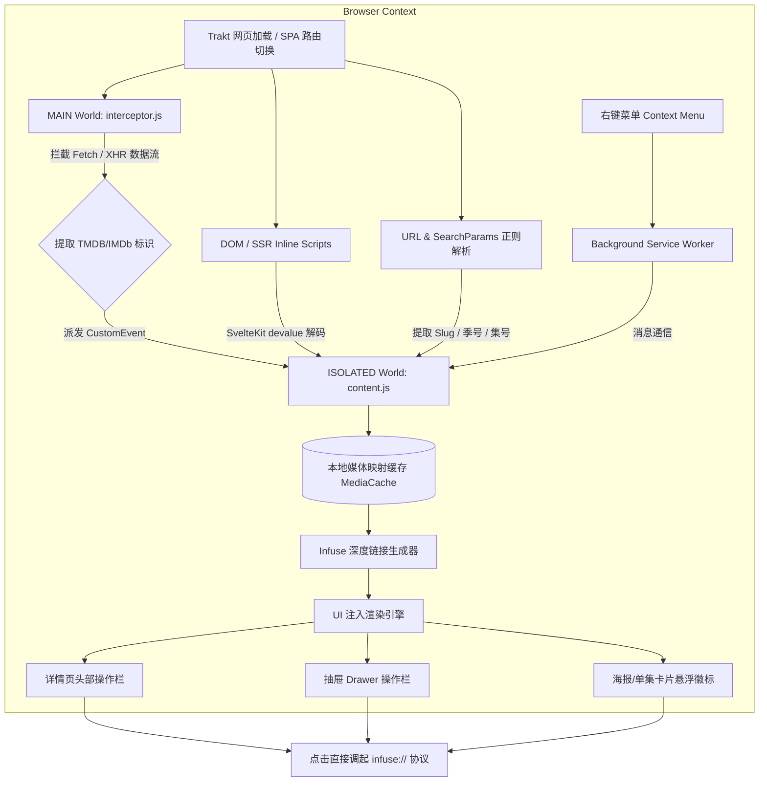

# Trakt to Infuse (Trakt2Infuse)

<p align="center">
  
</p>

<p align="center">
  <strong>无缝连接 Trakt 与 Infuse，在网页端一键直达本地/云端高品质播放体验。</strong>
</p>

<p align="center">
  
  <a href="https://github.com/lunanfo/Trakt2Infuse/raw/main/userscript/Trakt2Infuse.user.js">
    
  </a>
  
  
  
</p>

---

**Trakt to Infuse** 是专为影视爱好者打造的轻量级浏览器扩展程序与 Tampermonkey 油猴脚本。它无缝整合了 **[Trakt.tv](https://trakt.tv)**（包括其现代单页应用 **[app.trakt.tv](https://app.trakt.tv)**）与 Apple 生态顶级播放器 **[Infuse](https://firecore.com/infuse)**。

无论你是在浏览电影、电视剧主页、季度列表，还是点击任意单集，只需轻轻一点，即可通过 `infuse://` 协议直接在 Mac、iPhone、iPad 或 Apple TV 上调起 Infuse 开始播放！

---

## 📸 效果预览 (Preview)

插件精心适配了 Trakt 现代 Web 应用的设计规范，原生级融入界面，并完美支持亮暗双色主题自适应：

### 🌙 暗色模式效果 (Dark Mode)

详情页头部操作栏、侧边抽屉与卡片海报徽标均采用深色半透磨砂底板，配合橙色纯净 Infuse 标志，浑然一体：


### ☀️ 亮色模式效果 (Light Mode)

当处于亮色模式（如右侧抽屉展示）时，按钮底板与边框自动提取 Trakt 原生 CSS 变量（`--color-foreground` / `--color-card-background`），对色切换为浅色质感底板，自然融入浅色背景：


> **全场景 3 大原生级 UI 注入点**：
> 1. **详情页头部操作栏**：40×40 规格圆角操作按钮，紧贴原生紫色的「标记为已观看 (✓)」按钮左侧；
> 2. **季与单集侧边抽屉 (Drawer)**：在抽屉自身的独立操作栏内动态注入播放按钮，直达对应单集，不破坏顶部关闭区域；
> 3. **卡片海报浮动徽标**：在剧集季卡片、单集剧照、日历排期等海报左上角显示 26×26 的精致圆形浮动徽标，完整保留底部的原生「✓」操作，互不干扰。

---

## ✨ 核心特性 (Features)

### 1. ⚡ 零额外请求的智能网络拦截 (Smart Network Interceptor)
- **MAIN World 深度拦截**：在页面主执行上下文中拦截 `fetch` 与 `XMLHttpRequest`，截获 Trakt 内部 API（如 `apiz.trakt.tv/users/me/watching`、日历、同步记录、Watchlist、搜索等）的返回数据。
- **瞬时构建媒体映射**：在前端直接提取 `ids.tmdb` 与 `ids.imdb`，建立本地高速缓存，无需发起额外的网络查询，0 延迟、0 流量损耗。
- **回放缓冲区 (Replay Buffer)**：内置时序缓冲机制，页面加载前已完成解析的网络数据会在 Content Script 启动时自动重放，确保无一遗漏。
- **SvelteKit SSR 数据扫描**：智能解析内联页面脚本与 SvelteKit `__data.json`（devalue 序列化数据）。

### 2. 🎬 全场景原生 UI 注入 (Native-Grade UI Injection)
- **详情页头部 (Hero Summary Bar)**：规格为 40×40 的圆角操作按钮，精准插入在已观看（Checkmark）动作按钮左侧。
- **单集抽屉 (Episode Drawer)**：抽屉开启后，动态在抽屉主控制栏内注入单集播放按钮，不再错误地侵入顶部关闭区域。
- **卡片海报徽标 (Poster Floating Badge)**：在剧集季卡片、单集剧照、日历排期、推荐榜单等左上角显示 26×26 的精致圆形浮动徽标。
- **防重复与重绘防御**：针对 Svelte 单页应用的组件频繁卸载与重绘机制进行了响应式防御，DOM 更新后自动补齐，且绝不多重注入。

### 3. 🎨 完美主题自适应与精纯图标 (Adaptive Theming & Pure Mark)
- **剔除白底方块**：通过专门的图像处理管道自动扣除原始图标的白色底板，提取出纯净的橙色 Infuse 品牌标志。
- **自适应 Trakt 主题变量**：完美跟随 `dark`、`light`、`system` 外观以及 Trakt 季节性主题。
- **优雅交互动效**：悬停时触发高亮橙色光环与微缩放动效，视觉体验丝滑。

### 4. 📺 全维度 Infuse 协议链接覆盖 (Full Infuse Deep Link Support)
- **电影 (Movie)**：自动生成 TMDB / IMDb 电影链接。
- **电视剧主页 (Show)**：跳转整部电视剧主页。
- **指定季 (Season)**：跳转剧集具体季，特别篇（Specials）智能解析为第 0 季。
- **指定单集 (Episode)**：精确跳转至指定季与指定集。

### 5. 🛡️ 智能降级与容灾能力 (Fallback & Resilience)
- **URL 与文本智能提取**：支持现代查询参数（`?season=3&episode=1&view=episode`）与传统路径（`/seasons/3/episodes/1`），并辅以多语言标题（`第 3 季 • 第 1 集`、`S03E01`、`Season 3 Episode 1` 等）智能正则识别。
- **DOM 外链兜底**：自动扫描详情页中的 TMDB / IMDb 官方外链作为补充来源。
- **静默授权回退**：遇到冷门未缓存条目时，动态读取 Trakt 本地 OIDC Token 触发后台静默请求，并具备请求锁与 15 秒 TTL 超时释放保护。
- **右键上下文菜单**：在任何剧集或电影链接上点击鼠标右键，均可通过右键菜单「Open in Infuse」快速启动播放。

---

## 📋 深度链接规则对照表 (Deep Link Routing)

| 媒体分类 | Trakt 页面路径示例 | 生成的 Infuse 协议链接 | 链接说明 |
| :--- | :--- | :--- | :--- |
| **电影** | `/movies/oppenheimer-2023` | `infuse://movie/{tmdb_id}` | 支持 IMDb ID 兜底 |
| **电视剧** | `/shows/severance` | `infuse://series/{tmdb_id}` | 跳转剧集主页 |
| **指定季** | `/shows/severance?season=2` | `infuse://series/{tmdb_id}-2` | 支持跳转指定季 |
| **特别篇** | `/shows/severance?season=0` | `infuse://series/{tmdb_id}-0` | 特别篇映射为第 0 季 |
| **指定单集** | `/shows/severance?season=2&episode=1` | `infuse://series/{tmdb_id}-2-1` | 精确跳转单集播放 |

---

## 🚀 安装使用指南 (Installation)

### 选项 1：Tampermonkey 油猴脚本（一键安装）

1. 确保你的浏览器已安装 **[Tampermonkey (篡改猴)](https://www.tampermonkey.net/)** 或 **Violentmonkey (暴力猴)** 扩展。
2. 点击下方按钮（徽章）：

   [](https://github.com/lunanfo/Trakt2Infuse/raw/main/userscript/Trakt2Infuse.user.js)

3. 在弹出的页面点击「安装」或「更新」即可，无需手动复制代码。

> [!TIP]
> 如因网络环境问题无法打开 GitHub 直链，可使用国内加速镜像：[jsDelivr CDN 直链](https://fastly.jsdelivr.net/gh/lunanfo/Trakt2Infuse@main/userscript/Trakt2Infuse.user.js)。

#### 手动导入脚本（备选方法）：
1. 确保已安装 [Tampermonkey](https://www.tampermonkey.net/) 插件；
2. 点击浏览器工具栏的油猴图标 -> 选择 **「添加新脚本」**；
3. 打开本地仓库中的 [`userscript/Trakt2Infuse.user.js`](userscript/Trakt2Infuse.user.js)，全选复制代码并粘贴覆盖，保存即可。

---

### 选项 2：浏览器扩展程序 (Chrome / Edge / Brave / Arc)

适用于偏好独立扩展程序管理、无需安装脚本管理器的用户。

1. **获取代码**：
   下载本项目的最新 Release 压缩包并解压，或通过 Git 克隆到本地：
   ```bash
   git clone https://github.com/lunanfo/Trakt2Infuse.git
   ```
2. **打开扩展程序管理界面**：
   - Chrome / Brave / Arc：地址栏输入 `chrome://extensions/` 并回车
   - Edge：地址栏输入 `edge://extensions/` 并回车
3. **启用开发者模式**：开启页面右上角的 **「开发者模式 (Developer mode)」** 开关。
4. **加载扩展**：
   - 点击左上角的 **「加载已解压的扩展程序 (Load unpacked)」**。
   - 选择项目根目录下的 **`extension/`** 文件夹。
5. **开始体验**：
   - 访问 [app.trakt.tv](https://app.trakt.tv) 或 [trakt.tv](https://trakt.tv)，点击橙色 Infuse 按钮一键开启播放！

---

## 🏗️ 技术架构原理 (Architecture)



---

## 💻 本地开发与测试 (Development)

本项目采用 **单源驱动设计 (Single-Source Architecture)**，`extension/` 与 `userscript/` 共享同一套核心注入与样式逻辑，油猴脚本由构建脚本自动编译生成。

### 常用命令

```bash
# 1. 安装开发与测试依赖 (jsdom)
npm install

# 2. 重新编译生成透明品牌图标 (从原始 PNG 扣除白底)
npm run build:icons

# 3. 由 extension 源码构建最新的 Tampermonkey 油猴脚本
npm run build:userscript

# 4. 一键执行完整构建 (构建图标 + 构建脚本)
npm run build

# 5. 运行完整回归测试套件 (涵盖扩展程序与油猴脚本双端)
npm test

# 6. 单独测试某一端
TARGET=extension node tests/injection.test.js
TARGET=userscript node tests/injection.test.js
```

### 测试验证机制
测试套件使用 `jsdom` 严格复刻了 `app.trakt.tv` 的真实 DOM 树（包含 Svelte 动态插槽、Drawer 抽屉、卡片网格以及多种季集路由格式），对注入位置、选择器特异性、主题跟随、去重机制以及 Svelte 重绘后的自我修复进行全面校验。

---

## 📄 许可证 (License)

本项目基于 [MIT License](LICENSE) 开源。